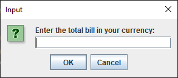
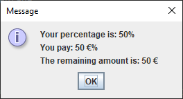

# ElectroCalc
[]: # License: MI7
[]: # Author: [S. Nedd]()

# How to run this project?

**Step 1:** Download this repository in your PC.

**Step 2:** Open the folder using IDE of choosing.

**Step 3:** /OR Open the src folder in your terminal.

**Step 4:** Run the following command in your terminal:

- javac ElectroCalc.java
- java ElectroCalc

**Step 4:** Enjoy the project!

# Software Output

# ------------------------ElectroCalc-----------------------

